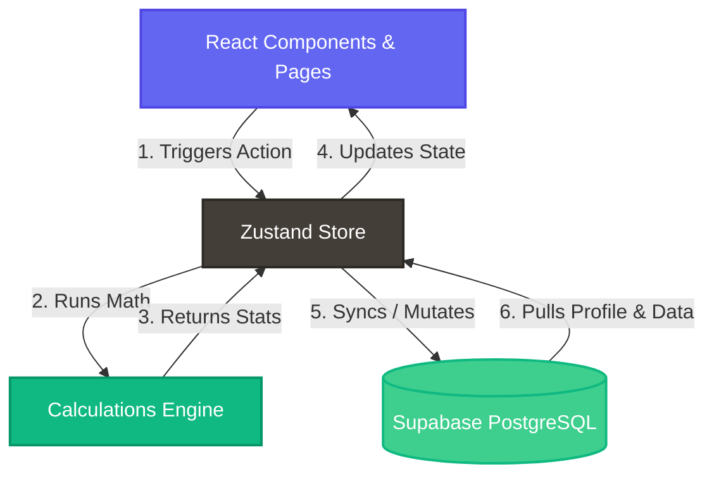

# 📅 RollCall — Premium Student Attendance Tracker & Bunk Simulator

[](https://vite.dev)
[](https://react.dev)
[](https://www.typescriptlang.org/)
[](https://tailwindcss.com/)
[](https://zustand-demo.pmnd.rs/)
[](https://supabase.com/)
[](https://vitest.dev/)
[](https://web.dev/explore/progressive-web-apps)
[](LICENSE)

## 📖 Table of Contents
- [✨ Features](#features)
- [🛠️ Technology Stack](#technology-stack)
- [📦 Project Architecture](#project-architecture)
- [🗺️ Application Flow](#application-flow)
- [📐 Calculations Logic](#calculations-logic)
- [🚀 Setup & Installation](#setup--installation)
- [🧪 Testing & Code Quality](#testing--code-quality)
- [📄 License](#license)

RollCall is a premium, feature-rich Progressive Web App (PWA) designed for college and university students to track daily attendance, monitor progress, simulate absent/present scenarios, and prevent detentions. 

Built using a modern tech stack—**React, TypeScript, Tailwind CSS, Zustand, and Supabase**—it provides a dark-themed, glassmorphic UI, responsive analytics, and real-time calculations.

---

## ✨ Features

- **🔐 Auth & User Profiles:** Secure signup and login powered by Supabase Auth. Displays initials-based custom colored avatars. Supports inline profile editing and secure password updates.
- **📚 Nested Subject Management:** Create and edit subjects with credits, semester metadata, and nested class types (e.g. Theory, Lab, Tutorial) with individual hourly weights and attendance targets.
- **⚡ Advanced Calculations Engine:** Runs real-time calculations for overall percentages, safe bunks available, consecutive sessions needed to restore target attendance, and worst-case projected percentages.
- **📅 Interactive Attendance Logging:** A comprehensive, grid-based calendar interface allowing quick status logging (`PRESENT`, `ABSENT`, `CANCELLED`, `HOLIDAY`) per class type.
- **📊 Responsive Analytics & Heatmaps:** Charts built with Recharts (Line, Bar, and Pie) depicting attendance trends over time, subject comparison rates, class type breakdowns, and intensity heatmaps.
- **📢 Smart Notifications:** Real-time warnings, tips, and alerts that appear in a notification bell popover when a subject falls near or below target levels.
- **🧪 Demo Data Seeder:** A one-click demo data seeder on the empty dashboard state to instantly populate 4 subjects and 60 days of mock weekday logs (~80% attendance rate) to try out the app.
  > [!TIP]
  > If you want to preview the charts and calendars immediately, use the one-click **Demo Data Seeder** button on the empty dashboard state to instantly populate mock subjects and logs.
- **🔗 Click-to-Home Brand Navigation:** Clicking the "RollCall" brand logo or text in the top-left of the user interface (sidebar on desktop, navbar on mobile) immediately routes the user back to the main menu/dashboard.
- **🔗 Shareable Public Reports:** Generate secure snapshot links (valid for 7 days) of your overall attendance statistics to share publicly without requiring authentication.
- **📱 PWA & Offline Support:** Desktop and mobile standalone installation support with full asset caching via service workers.
- **⚠️ Defensive Crash Recovery:** Global error boundaries that catch layout-level rendering exceptions and provide single-click session recovery.

---

## 🛠️ Technology Stack

| Layer | Technologies |
| :--- | :--- |
| **Frontend** | React 18, TypeScript, Vite, Tailwind CSS |
| **Icons** | Lucide React |
| **Visualizations** | Recharts (Line, Pie, Bar charts) |
| **Database & Realtime** | Supabase (PostgreSQL, Row Level Security, Triggers) |
| **State Management** | Zustand |
| **PWA Engine** | Service Worker API, Web Manifests |
| **Testing Framework** | Vitest |

---

## 📦 Project Architecture

```text
├── public/                 # Static assets, sw.js, and manifest.json
├── src/
│   ├── components/         # Reusable UI widgets and layout modules
│   │   ├── layout/         # Sidebar, Navbar, PageWrapper, NotificationBell
│   │   ├── shared/         # ConfirmDialog, ErrorBoundary, SubjectModal
│   │   └── ui/             # Core UI buttons and dialog primitives
│   ├── hooks/              # Custom React hooks (auth, analytics, seeder, detail)
│   ├── lib/                # Pure utility modules (calculations, database, csv)
│   ├── pages/              # Routing pages (Dashboard, Attendance, Profile, etc.)
│   ├── store/              # Zustand global state stores (auth, subjects, toast)
│   ├── types/              # TypeScript interface definitions
│   ├── App.tsx             # Master router, lazy loads, and wrappers
│   ├── index.css           # Global stylesheets and theme tokens
│   └── main.tsx            # App bootstrapping and PWA registration
├── supabase_schema.sql     # Database structure, RLS, and triggers
├── vercel.json             # Vercel SPA redirect config
├── package.json            # Configuration and script pipelines
└── tsconfig.json           # TypeScript compilation configuration
```

---

## 🗺️ Application Flow



---

## 📐 Calculations Logic

The core calculations engine ([calculations.ts](file:///c:/Users/rushi/Videos/PROJECTS/ATTENDANCE/src/lib/calculations.ts)) handles the key arithmetic:

### 1. Attendance Percentage
$$\text{Current Attendance \%} = \left( \frac{\text{Hours Present}}{\text{Hours Held}} \right) \times 100$$
Where hours are calculated based on session durations (e.g. Theory = 1 hr, Lab = 2 hrs).

### 2. Safe Bunks Simulation
Calculates the maximum number of classes that can be missed consecutively without dropping below the target threshold ($T$, e.g. $0.75$ for 75%):
$$\text{Safe Bunks} = \lfloor \frac{\text{Hours Present} - (T \times \text{Hours Held})}{\text{Hours Per Session} \times T} \rfloor$$

### 3. Classes Needed to Recover
Calculates the consecutive number of classes that must be attended to restore attendance back to the target threshold ($T$):
$$\text{Classes Needed} = \lceil \frac{(T \times \text{Hours Held}) - \text{Hours Present}}{\text{Hours Per Session} \times (1 - T)} \rceil$$

### 4. Projected Attendance
Calculates the estimated attendance percentage at the end of the semester, assuming the user misses all remaining planned sessions:
$$\text{Projected \%} = \left( \frac{\text{Hours Present}}{\text{Total Planned Hours}} \right) \times 100$$

---

## 🚀 Setup & Installation

### Prerequisites
- Node.js (v18 or higher)
- npm or yarn
- A Supabase account

### 1. Clone & Install
```bash
git clone https://github.com/RushiShah1612/BunkCalculator.git
cd BunkCalculator
npm install
```

### 2. Configure Database
1. Create a project at [supabase.com](https://supabase.com).
2. Open the **SQL Editor** in the Supabase dashboard and run the entire script found in:
   [`supabase_schema.sql`](file:///c:/Users/rushi/Videos/PROJECTS/ATTENDANCE/supabase_schema.sql)

> [!IMPORTANT]
> You must run the entire `supabase_schema.sql` script inside the Supabase SQL Editor before running the development server to ensure all tables, Row Level Security (RLS) rules, and custom database triggers are fully provisioned.

### 3. Setup Local Environment
Create a `.env.local` file in the project root:
```env
VITE_SUPABASE_URL=your_supabase_project_url
VITE_SUPABASE_ANON_KEY=your_supabase_anon_key
```

### 4. Run Locally
```bash
npm run dev
```

---

## 🧪 Testing & Code Quality

Verify that all systems are stable and pass quality checks:

```bash
# Run unit tests for calculations
npm run test

# Run typescript type check
npx tsc --noEmit

# Run code style audits
npm run lint

# Build the production bundle
npm run build
```

---

## 📄 License
This project is open-source. Feel free to clone, modify, and run your own deployments.
